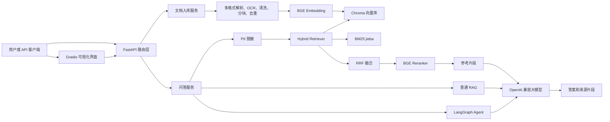

# 企业私有知识库问答平台

基于 **FastAPI + Gradio + LangChain + LangGraph** 的本地企业 RAG 问答系统。当前版本为 **v1.1-lite**，定位是轻量可运行、可演示、可逐步扩展：支持多格式文档入库、可选视觉 OCR、Chroma 向量存储、BGE Embedding、BM25 混合检索、BGE Reranker 重排、普通 RAG 与 Agent 两种问答模式。

> 当前项目已经切换为项目内 `.venv`，Python 版本为 3.10。推荐使用 `run_venv.ps1` 启动。

---

## 当前功能

| 模块 | 已支持能力 | 说明 |
|---|---|---|
| 文档入库 | 批量上传、解析、清洗、分块、去重、增量 upsert | 分块默认为 `CHUNK_SIZE=800`、`CHUNK_OVERLAP=150`，支持 `CHUNK_STRATEGY=char/token` |
| 文件格式 | PDF、TXT、MD、CSV、JSON/JSONL、XML、HTML、DOC/DOCX、XLS/XLSX、PPT/PPTX、RTF、ODT/ODS/ODP、EPUB、图片 | 老版 `.doc/.xls/.ppt` 依赖 Windows + 本机 Microsoft Office |
| 图片 OCR | 可选接入 OpenAI 兼容视觉模型 | 默认关闭；开启后支持 `jpg/png/gif/bmp/webp/tiff` 等图片 OCR |
| 扫描版 PDF OCR | 可选接入视觉 OCR | PDF 先尝试提取文本层，文本过少且开启 OCR 时，用 PyMuPDF 渲染页面再 OCR |
| 向量库 | Chroma 本地持久化 | 默认目录 `./data/chroma`，启动脚本中使用 `./data/chroma310` |
| Embedding | 本地 BGE：`BAAI/bge-small-zh-v1.5` | 通过 sentence-transformers 加载，优先本地缓存，无缓存再下载 |
| 混合检索 | 稠密向量 + BM25 + RRF | BM25 使用 jieba 中文分词；向量库变更后自动刷新 BM25 索引 |
| Rerank | BGE CrossEncoder 重排 | 默认 `BAAI/bge-reranker-base`，用于二次排序和阈值过滤 |
| HyDE | 可选查询改写 | 通过大模型生成假想文档增强召回 |
| 普通 RAG | 检索片段后基于参考资料生成答案 | Prompt 强约束：资料不足时说明无法回答 |
| Agent 模式 | LangGraph 决策、拆解、检索、反思、生成 | 可判断是否检索、拆解复杂问题、最多多轮补充检索 |
| 多轮对话 | Gradio messages 历史 + 摘要压缩 | 长历史会尝试摘要压缩，失败时保留最近对话 |
| 隐私保护 | PII 输入、历史、参考资料、答案、来源片段脱敏 | 默认开启，可在 UI 或请求参数关闭 |
| 知识库管理 | 文档列表、按来源删除、清空向量库 | UI 和 API 均支持 |
| API | FastAPI REST 接口 + Swagger 文档 | `/docs` 查看接口文档 |
| UI | Gradio 管理页 + 问答页 | 支持上传进度、参数调节、来源片段展示 |
| 配置兼容 | OpenAI / DeepSeek / DashScope Key 兼容 | 支持 `OPENAI_API_KEY`、`DEEPSEEK_API_KEY`、`DASHSCOPE_API_KEY`、`OCR_API_KEY`，并自动忽略占位 key |
| 自检 | `selftest.py` / `eval_retrieval.py` / `ocr_selftest.py` | 可分别验证检索通路、检索质量和 OCR 配置 |

---

## v1.1 新增优化

| 能力 | 说明 |
|---|---|
| API Key 自动选择 | 根据 `OPENAI_BASE_URL` 自动优先选择 DeepSeek 或 DashScope Key；没有专用 Key 时再回退到通用 `OPENAI_API_KEY` |
| 占位 Key 保护 | `sk-your-key-here`、`your-api-key` 等示例值不会被当作真实 Key 发起请求 |
| OCR Key 兜底 | OCR 优先使用 `OCR_API_KEY`，其次使用 `DASHSCOPE_API_KEY`，最后回退 `OPENAI_API_KEY` |
| 分块策略抽象 | 新增 `rag/chunking.py`，支持 `CHUNK_STRATEGY=char/token` |
| 轻量 token 分块 | 不新增依赖，用中文单字、英文约 4 字符的方式估算 token，适合作为精确 tokenizer 前的过渡方案 |
| OCR 自检 | 新增 `ocr_selftest.py`，可只检查配置，也可传入图片真实调用 OCR |
| 检索评测 | 新增 `eval_retrieval.py` 和 `eval/questions.jsonl`，用于评估 Top-K 来源命中和关键词命中 |
| 模型加载提示 | Embedding/Rerank 模型缺失或下载失败时，返回更清晰的中文错误提示 |

---

## 当前未接入

下面这些是企业级扩展方向，当前代码中还没有真正接入，不应按已完成能力对外描述：

| 能力 | 当前状态 |
|---|---|
| Apache Tika 文档解析 | 未接入；当前使用 Python 内置/第三方库和部分 Office COM 解析 |
| DashScope Embedding | 未接入；当前是本地 BGE Embedding |
| Milvus 向量库 | 未接入；当前是 Chroma |
| jtokkit 精确 token 分块 | 未接入；当前支持递归字符分块和轻量 token 估算分块 |
| MySQL 问答日志 | 未接入 |
| Redis 答案缓存 | 未接入 |
| Redis/IP 限流 | 未接入 |
| Token 鉴权与角色隔离 | 未接入 |
| 独立管理员后台/用户门户 | 未拆分；当前是 Gradio 单体界面 |
| MCP Server | 未接入 |

---

## 架构概览



---

## 目录结构

```text
enterprise_rag/
├── main.py                 # FastAPI 应用入口，挂载 Gradio
├── run_venv.ps1            # 使用项目 .venv 启动
├── selftest.py             # 无需 API Key 的检索链路自检
├── eval_retrieval.py       # 检索质量评测脚本
├── ocr_selftest.py         # OCR 配置检查/可选实测脚本
├── requirements.txt        # Python 依赖
├── .env.example            # 配置模板
├── api/
│   └── routes.py           # API 路由与 UI 共用服务函数
├── eval/
│   └── questions.jsonl     # 检索评测用例
├── agent/
│   ├── agent_graph.py      # 普通 RAG、HyDE、LangGraph Agent
│   ├── graph_state.py      # Agent 状态定义
│   └── llm.py              # OpenAI 兼容 LLM 客户端
├── middleware/
│   ├── pii_middleware.py   # PII 脱敏
│   ├── retry_middleware.py # 工具/模型调用重试
│   └── summary_middleware.py # 长对话摘要压缩
├── rag/
│   ├── chunking.py         # char/token 分块策略
│   ├── document_loader.py  # 多格式解析、OCR 调度、分块、去重
│   ├── retriever.py        # 向量 + BM25 + RRF + Rerank
│   ├── vector_store.py     # Chroma + BGE Embedding
│   └── ocr/
│       ├── base.py         # OCR Provider 抽象
│       └── qwen_vl.py      # OpenAI 兼容视觉 OCR Provider
├── ui/
│   └── web_app.py          # Gradio 知识库管理与问答页面
├── utils/
│   ├── config.py           # 全局配置
│   └── common.py           # 日志、清洗、哈希等公共函数
└── samples/                # 示例文档
```

---

## 快速启动

### 1. 使用现有环境启动

```powershell
.\run_venv.ps1
```

启动后访问：

- Gradio 页面：`http://127.0.0.1:8000/`
- API 文档：`http://127.0.0.1:8000/docs`

### 2. 手动启动

```powershell
$env:PYTHONUTF8 = "1"
$env:CHROMA_DIR = "./data/chroma310"
.\.venv\Scripts\python.exe main.py
```

### 3. 重新安装依赖

```powershell
.\.venv\Scripts\python.exe -m pip install -r requirements.txt
```

如果需要首次下载本地 BGE 模型，网络环境要能访问 HuggingFace 或 `HF_ENDPOINT` 配置的镜像。

---

## 配置说明

复制 `.env.example` 为 `.env` 后修改：

```ini
# 大模型，兼容 OpenAI 格式，可配置 OpenAI / DeepSeek / 本地模型服务
OPENAI_API_KEY=sk-your-key-here
DEEPSEEK_API_KEY=
DASHSCOPE_API_KEY=
OPENAI_BASE_URL=https://api.deepseek.com/v1
LLM_MODEL=deepseek-chat
LLM_TEMPERATURE=0.1

# 本地 Embedding / Rerank
EMBEDDING_MODEL=BAAI/bge-small-zh-v1.5
RERANK_MODEL=BAAI/bge-reranker-base

# Chroma
CHROMA_DIR=./data/chroma
COLLECTION_NAME=enterprise_kb

# 检索与分块
TOP_K=5
SCORE_THRESHOLD=0.3
ENABLE_HYDE=false
ENABLE_PII=true
CHUNK_STRATEGY=char
CHUNK_SIZE=800
CHUNK_OVERLAP=150
```

Key 选择规则：

- `OPENAI_BASE_URL` 包含 `deepseek` 时，优先使用 `DEEPSEEK_API_KEY`。
- `OPENAI_BASE_URL` 包含 `dashscope` 或 `aliyuncs` 时，优先使用 `DASHSCOPE_API_KEY`。
- 其他 OpenAI 兼容服务默认优先使用 `OPENAI_API_KEY`。
- OCR 优先使用 `OCR_API_KEY`，其次使用 `DASHSCOPE_API_KEY`，最后使用 `OPENAI_API_KEY`。
- 示例占位值不会被当作真实 Key 使用。

### OCR 配置

OCR 默认关闭。开启后，图片和扫描版 PDF 会发送到配置的视觉模型服务。

```ini
ENABLE_OCR=true
OCR_PROVIDER=qwen-vl
OCR_MODEL=qwen-vl-ocr-latest
OCR_BASE_URL=https://dashscope.aliyuncs.com/compatible-mode/v1
OCR_API_KEY=你的视觉模型 API Key
OCR_MAX_PAGES=20
OCR_DPI=180
OCR_PDF_MIN_TEXT_CHARS=30
```

当前 OCR Provider 使用 OpenAI 兼容接口形式，适合接入 DashScope 千问 VL OCR 类模型。是否能调用成功取决于对应平台是否给该 API Key 开通视觉模型权限。

---

## API 一览

| 方法 | 路径 | 说明 |
|---|---|---|
| `POST` | `/api/ingest` | 批量上传文档并入库 |
| `POST` | `/api/ask` | 智能问答，支持 `rag` / `agent` 模式 |
| `GET` | `/api/documents/supported-types` | 查看支持的文档格式、OCR、分块和向量库配置 |
| `GET` | `/api/doc/supported-types` | 兼容路径，同上 |
| `GET` | `/api/documents` | 查看已入库文档列表 |
| `DELETE` | `/api/documents/source?source=文件名` | 删除指定来源文件的所有片段 |
| `DELETE` | `/api/documents` | 清空向量库 |
| `DELETE` | `/api/doc/clear` | 兼容路径，清空向量库 |
| `GET` | `/api/health` | 健康检查 |

问答请求示例：

```bash
curl -X POST http://127.0.0.1:8000/api/ask \
  -H "Content-Type: application/json" \
  -d "{\"question\":\"公司的报销流程是怎样的？\",\"mode\":\"agent\",\"top_k\":5}"
```

---

## 自检

无需配置大模型 API Key，可以先验证入库和检索链路：

```powershell
.\.venv\Scripts\python.exe selftest.py
```

该脚本会：

1. 清空测试向量库。
2. 加载 `samples/` 示例文档。
3. 写入 Chroma。
4. 执行向量检索 + BM25 + RRF + BGE Reranker。
5. 输出每个测试问题的 Top-K 命中文档。

完整问答链路需要配置可用的 `OPENAI_API_KEY` / `DEEPSEEK_API_KEY` / `DASHSCOPE_API_KEY`、`OPENAI_BASE_URL` 和 `LLM_MODEL`。

### OCR 配置自检

默认只检查配置，不调用云端：

```powershell
.\.venv\Scripts\python.exe ocr_selftest.py
```

传入图片后会真实调用 OCR：

```powershell
.\.venv\Scripts\python.exe ocr_selftest.py --image path\to\image.png
```

### 检索质量评测

评测前清空库并重新入库 `samples/`：

```powershell
.\.venv\Scripts\python.exe eval_retrieval.py --ingest-samples
```

用例在 `eval/questions.jsonl` 中维护，可持续补充真实业务问题。

---

## 技术选型

| 角色 | 当前选型 |
|---|---|
| Web/API | FastAPI + Uvicorn |
| 可视化界面 | Gradio |
| 编排 | LangGraph |
| LLM 调用 | OpenAI 兼容接口 |
| 文本分块 | RecursiveCharacterTextSplitter / 轻量 token 估算分块 |
| Embedding | sentence-transformers + BGE small zh |
| 向量库 | Chroma PersistentClient |
| 关键词检索 | rank-bm25 + jieba |
| 结果融合 | RRF |
| Rerank | BGE CrossEncoder |
| OCR | 可配置 OpenAI 兼容视觉 OCR Provider |
| PDF 文本解析 | pypdf |
| 扫描 PDF 渲染 | PyMuPDF |

---

## 建议演进路线

为避免一次性把轻量 RAG 做成复杂平台，建议分版本推进：

| 版本 | 目标 |
|---|---|
| v1-lite | 保持当前本地可运行版，完善 OCR、格式解析、检索体验和自检 |
| v2-pro | 接入 DashScope Embedding、Milvus、token 分块、MySQL 日志、Redis 缓存/限流 |
| v3-platform | 增加 Token 鉴权、角色隔离、管理员后台、用户端门户、MCP Server |

这样可以保留当前项目的可演示性，同时为生产级能力预留清晰边界。
